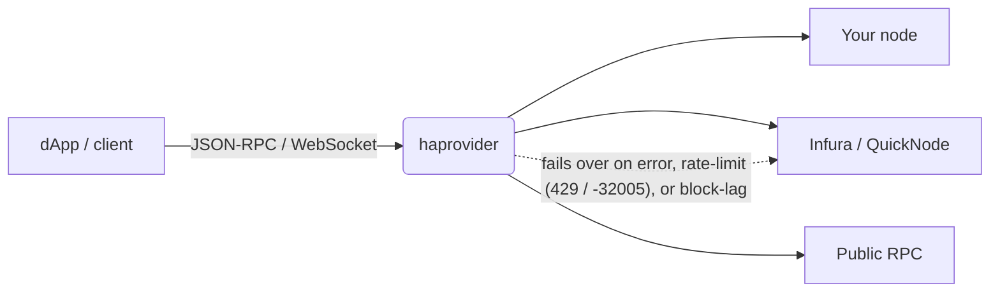

# haprovider

[](https://github.com/wille/haprovider/releases)
[](https://github.com/wille/haprovider/actions)
[](https://pkg.go.dev/github.com/wille/haprovider)
[](https://goreportcard.com/report/github.com/wille/haprovider)
[](LICENSE)
[](https://www.repostatus.org/#active)

*High Availability Provider* is a load balancer for Ethereum (and EVM L2s), Solana, Tron and Bitcoin JSON-RPC nodes — put one stable endpoint in front of your own nodes **and** providers like Infura/QuickNode/Alchemy, and haprovider health-checks each one and fails over automatically. No more single points of failure, rate-limit outages, or serving stale data from a node that has fallen behind the chain.



Providers are tried in priority order; an unhealthy one is taken out of rotation and re-checked in the background until it recovers.

### Reasons for using haprovider

- Zero downtime - RPC providers can and will have trouble providing you uninterrupted 24/7 access. You should have at least two providers powering your access to a chain, like your own node and a service like Infura as a backup.

- You run your own node and you don't want to disrupt your service when you take it down for maintenance/upgrades.

- You don't want to deal with the maintenance and costs of your own nodes for storage intensive Ethereum L2 chains or a local Solana node with high hardware requirements


## Table of Contents
- [Features](#features)
- [How it compares](#how-it-compares)
- [Installation](#installation)
- [Quick Start](#quick-start)
- [Configuration](#configuration)
- [Examples](#examples)
- [Monitoring](#monitoring)
- [Troubleshooting](#troubleshooting)
- [Contributing](#contributing)

## Features

- **High Availability**: Move any fallback logic from your application layer and rely on one RPC endpoint
- **Automatic Failover**: Handles request failures and forwards to the next available node or node provider
- **Traffic Observability**: Monitor and analyze your RPC traffic patterns
- **Request Validation**: Validates requests and responses to detect errors
- **Rate Limit Handling**: Detects rate limits and retries once the provider is available again
- **Connection Optimization**: Upstream keepalive/http2 connection pooling
- **Health Checks**: Automatic health monitoring of all configured providers

### *What haprovider doesn't do right now*

- Response caching
- Transaction broadcasts to multiple nodes

## Installation

```bash
# Prebuilt binary: download from the releases page
# https://github.com/wille/haprovider/releases

# Using Go
go install github.com/wille/haprovider/cmd/haprovider@latest

# Using Docker
docker pull ghcr.io/wille/haprovider
```

## Quick Start

1. Create a configuration file `config.yml`:
```yml
endpoints:
  ethereum:
    kind: eth
    chainId: "1"
    providers:
      - name: Local node
        http: http://localhost:8145
        ws: ws://localhost:8146
      - name: backup
        http: https://eth.llamarpc.com
```

2. Start the service:
```bash
$ haprovider
```

Or with command line options:
```bash
$ haprovider --config config.yml --log-level debug --log-json
```

3. Connect your application:
```typescript
import { ethers } from 'ethers';

// ethers.js v6
const provider = new ethers.JsonRpcProvider('http://localhost:8080/eth');
// or
const provider = new ethers.WebSocketProvider('ws://localhost:8080/eth');
```

## Configuration

The configuration file supports the following options:

```yml
# Global settings
port: 8080
log_level: info  # debug, info, warn, error
log_json: false  # Enable JSON logging

# Endpoint configurations
endpoints:
  ethereum:
    kind: eth
    chainId: "1"
    providers:
      - name: Local node
        http: http://localhost:8145
        ws: ws://localhost:8146
        timeout: 10s
      - name: Infura
        http: https://mainnet.infura.io/v3/<api-key>
        ws: wss://mainnet.infura.io/ws/v3/<api-key>
  solana:
    kind: solana
    providers:
      - name: quicknode
        http: https://solana-mainnet.quicknode.pro/<api-key>
```

### Configuration Options

- `port`: HTTP/WS server port (default: 8080)
- `metrics_port`: Prometheus port (default: none)
- `healthcheck_interval`: How often each provider is health-checked (e.g. `10s`, `1m`) (default: 30s)
- `log_level`: Logging level (debug, info, warn, error)
- `log_json`: Enable JSON logs
- `endpoints`: Map of endpoint configurations
  - `kind`: Chain type (eth, solana, tron, btc) (default: eth)
  - `chainId`: Network chain ID (optional, EVM chains)
  - `block_lag_tolerance`: How many blocks a provider may trail the highest seen tip before it's considered unhealthy (optional, per-chain default)
  - `max_response_size`: Max upstream response size in bytes (optional, default 100MB, 0 = unlimited)
  - `public`: If this endpoint is available to the public. A public endpoint will not include detailed error messages and headers (optional, default false)
  - `add_xfwd_headers`: Add X-Forwarded-For to upstream requests (optional, default false)
  - `providers`: List of provider configurations
    - `name`: Provider identifier
    - `http`: HTTP endpoint URL (required)
    - `ws`: WebSocket endpoint URL (optional)
    - `timeout`: Request timeout (optional, default 10s)


### Command Line Options

- `--config`: Path to config file (default: config.yml). Raw config YAML can be provided via $HA_CONFIG
- `--port`: HTTP/WS server address (default: :8080) ($HA_PORT)
- `--metrics-port`: Prometheus port (default: none) ($HA_METRICS_PORT)
- `--log-level`: Logging level (debug, info, warn, error) (default: info) ($HA_LOG_LEVEL)
- `--log-json`: Enable JSON logging (default: false) ($HA_LOG_JSON)

> [!NOTE]
> Command line arguments take precedence over configuration file settings. For example, if you specify `--log-level debug` on the command line, it will override the `log_level` setting in the config file.

## Examples

### Ethereum with Multiple Providers

```yml
endpoints:
  ethereum:
    kind: eth
    chainId: "1"
    providers:
      - name: Local node
        http: http://localhost:8145
        ws: ws://localhost:8146
      - name: Infura
        http: https://mainnet.infura.io/v3/<api-key>
        ws: wss://mainnet.infura.io/ws/v3/<api-key>
      - name: QuickNode
        http: https://mainnet.quicknode.pro/<api-key>
        ws: wss://mainnet.quicknode.pro/<api-key>
```

### Solana Configuration

```yml
endpoints:
  solana:
    kind: solana
    providers:
      - name: quicknode
        http: https://solana-mainnet.quicknode.pro/<api-key>
      - name: fallback
        http: https://solana.rpc.helius.network
```

## Monitoring

haprovider exposes Prometheus metrics for monitoring:

- `haprovider_requests_total`: Total number of requests
- `haprovider_failed_requests_total`: Failed requests
- `haprovider_request_duration_seconds`: Request duration histogram
- `haprovider_open_connections`: Open connections
- `haprovider_provider_health`: Provider health status
- `haprovider_provider_errors_total`: Total provider errors

Enable metrics with configuration option `metrics_port: 127.0.0.1:9090`

## Contributing

Contributions are welcome! Please feel free to submit a Pull Request.